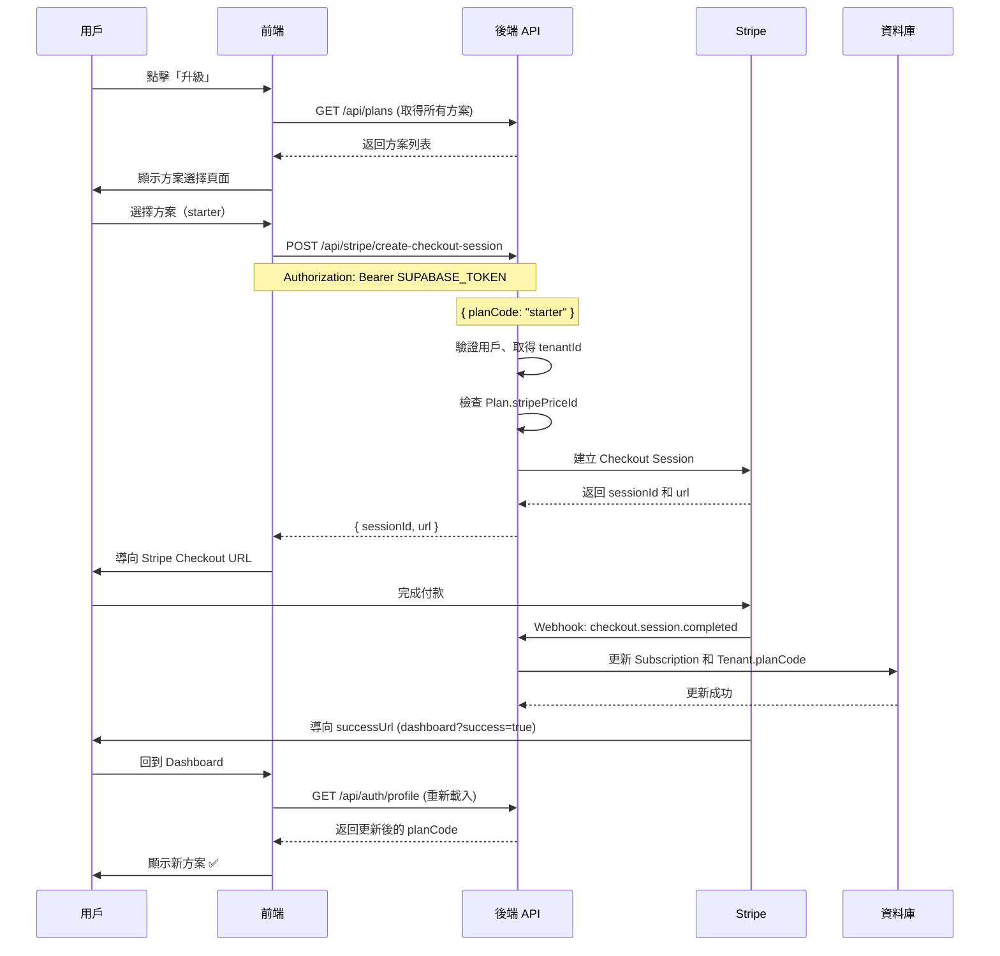

# Stripe 方案升級流程規劃

## 📋 概述

實作用戶從 free plan 升級到 starter plan（或其他付費方案）的完整流程。

## 🎯 目標流程

```
用戶在 Dashboard 看到當前方案（free）
    ↓
點擊「升級」或「查看方案」
    ↓
顯示方案選擇頁面（列出所有可用方案）
    ↓
選擇目標方案（例如：starter）
    ↓
呼叫 Backend API 建立 Stripe Checkout Session
    ↓
導向 Stripe Checkout 頁面
    ↓
用戶完成付款
    ↓
Stripe Webhook 自動更新資料庫（tenant.planCode）
    ↓
用戶回到 Dashboard，看到方案已升級 ✅
```

## 📐 架構設計

### 資料流程圖



## 🔧 實作計劃

### 階段 1: 前端 - 方案選擇頁面

**位置**: `apps/frontend/src/app/[locale]/plans/page.tsx`（新建）

**功能**:
1. 顯示所有可用方案（從 `/api/plans` 取得）
2. 標示當前方案
3. 顯示每個方案的價格和功能
4. 「選擇方案」按鈕

**UI 設計**:
- 卡片式佈局，每個方案一張卡片
- 當前方案標示「目前方案」
- 免費方案顯示「免費」
- 付費方案顯示價格和「立即訂閱」按鈕

### 階段 2: 前端 - Stripe API 整合

**檔案**: `apps/frontend/src/lib/api/stripe.ts`（新建）

**功能**:
```typescript
export const stripeApi = {
  // 建立 Checkout Session
  async createCheckoutSession(planCode: string): Promise<{ sessionId: string; url: string }> {
    const token = await getAuthToken();
    const response = await fetch(`${API_URL}/stripe/create-checkout-session`, {
      method: 'POST',
      headers: {
        'Authorization': `Bearer ${token}`,
        'Content-Type': 'application/json',
      },
      body: JSON.stringify({ planCode }),
    });
    // 處理回應...
  },
  
  // 取得所有方案
  async getPlans(): Promise<Plan[]> {
    const response = await fetch(`${API_URL}/plans`);
    // 處理回應...
  },
}
```

### 階段 3: 修改 PlanQuotaModal

**檔案**: `apps/frontend/src/components/dashboard/PlanQuotaModal.tsx`

**修改**:
- 將「升級」按鈕從外部連結改為內部路由
- 點擊後導向 `/plans` 頁面（方案選擇頁面）

### 階段 4: 處理付款成功後的流程

**檔案**: `apps/frontend/src/app/[locale]/dashboard/page.tsx`

**修改**:
- 監聽 URL 參數 `?success=true`
- 如果檢測到 `success=true`，重新載入 `userProfile`
- 顯示成功訊息

## 📝 詳細流程說明

### 步驟 1: 用戶點擊「升級」

**觸發點**:
- Dashboard 用戶選單 → 「查看方案與配額」
- PlanQuotaModal → 「升級」按鈕

**動作**:
- 導向 `/zh-TW/plans` 頁面

### 步驟 2: 顯示方案選擇頁面

**頁面**: `/zh-TW/plans`

**顯示內容**:
- 所有方案列表（free, starter, pro, enterprise）
- 每個方案顯示：
  - 方案名稱和代碼
  - 價格（TWD/月）
  - 功能列表（maxChatbots, maxFaqsPerBot, etc.）
  - 功能開關（Analytics, API, Export）
  - 當前方案標示
  - 「選擇方案」或「立即訂閱」按鈕

**資料來源**:
- `GET /api/plans` - 取得所有方案
- `userProfile.tenant.planCode` - 當前方案

### 步驟 3: 用戶選擇方案

**動作**:
- 點擊目標方案的「立即訂閱」按鈕
- 呼叫 `stripeApi.createCheckoutSession(planCode)`

**處理**:
- 顯示載入狀態
- 取得 Checkout Session URL
- 導向 Stripe Checkout 頁面

### 步驟 4: Stripe Checkout 付款

**流程**:
- 用戶在 Stripe Checkout 頁面完成付款
- 使用測試卡號：`4242 4242 4242 4242`
- 完成後 Stripe 導向 `successUrl`

### 步驟 5: Webhook 處理

**自動處理**（無需前端介入）:
- Stripe 發送 `checkout.session.completed` Webhook
- Backend 處理：
  - 建立/更新 Subscription 記錄
  - 更新 `Tenant.planCode`
  - 記錄付款資訊

### 步驟 6: 回到 Dashboard

**URL**: `dashboard?success=true`

**處理**:
- 檢測 URL 參數 `success=true`
- 重新載入 `userProfile`
- 顯示成功訊息：「方案已升級至 Starter」
- 更新 UI 顯示新方案

## 🎨 UI/UX 設計建議

### 方案選擇頁面

```
┌─────────────────────────────────────────┐
│  選擇方案                                │
├─────────────────────────────────────────┤
│                                         │
│  ┌──────────┐  ┌──────────┐           │
│  │  Free    │  │  Starter │ ← 選擇    │
│  │  $0/月   │  │  $900/月 │           │
│  │  [目前]  │  │          │           │
│  └──────────┘  └──────────┘           │
│                                         │
│  ┌──────────┐  ┌──────────┐           │
│  │  Pro     │  │Enterprise│           │
│  │  $2990/月│  │  $8990/月│           │
│  └──────────┘  └──────────┘           │
│                                         │
└─────────────────────────────────────────┘
```

### 成功訊息

```
✅ 方案升級成功！

您已成功升級至 Starter 方案
新方案將立即生效
```

## 🔄 升級流程的關鍵點

### 1. 不需要取消現有訂閱
- Free plan 沒有 Stripe 訂閱
- 直接建立新的訂閱即可

### 2. Webhook 自動處理
- 不需要前端輪詢檢查
- Stripe Webhook 自動更新資料庫
- 用戶回到 Dashboard 時重新載入即可

### 3. 錯誤處理
- Checkout Session 建立失敗 → 顯示錯誤訊息
- 付款失敗 → Stripe 會導向 `cancelUrl`
- Webhook 處理失敗 → 後端日誌記錄，可手動處理

## 📋 實作檢查清單

### Backend（已完成 ✅）
- [x] Stripe Service
- [x] Stripe Controller
- [x] Webhook 處理邏輯
- [x] Plans API

### Frontend（待實作）
- [ ] 建立 `/plans` 頁面
- [ ] 建立 `stripeApi` 服務
- [ ] 修改 PlanQuotaModal 的「升級」按鈕
- [ ] 處理付款成功後的重新載入
- [ ] 新增翻譯文字（zh-TW.json）

## 🎯 最小實作版本

如果不想大改，可以：

1. **修改 PlanQuotaModal**
   - 將「升級」按鈕改為呼叫 `stripeApi.createCheckoutSession('starter')`
   - 直接導向 Stripe Checkout（不顯示方案選擇頁面）

2. **處理成功返回**
   - Dashboard 監聽 `?success=true`
   - 重新載入 userProfile

這樣就可以實現最簡單的升級流程，不需要新建頁面。

## 💡 建議

**方案 A: 完整實作（推薦）**
- 建立方案選擇頁面
- 用戶可以選擇任意方案
- 更好的 UX

**方案 B: 簡化實作**
- 只修改 PlanQuotaModal
- 點擊「升級」直接升級到 starter
- 快速上線

你比較傾向哪個方案？
